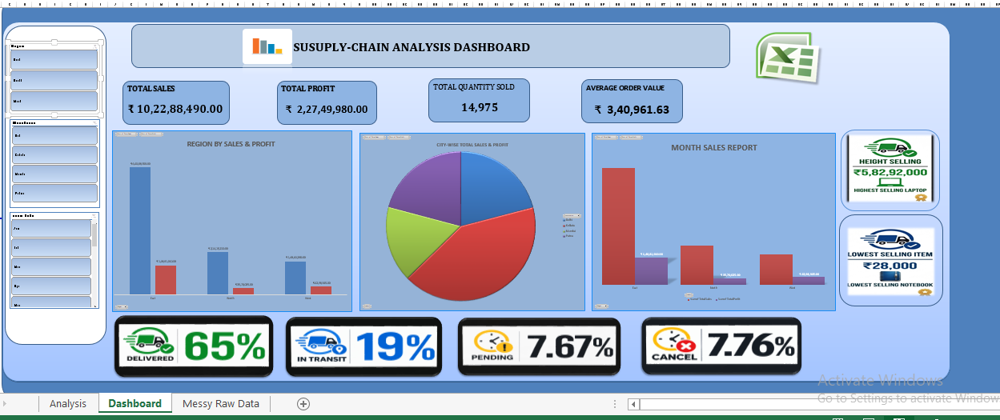

# 📦 Supply Chain Analysis Dashboard

## 📊 Project Overview
This project analyzes inventory and supply chain data using Microsoft Excel. The goal is to clean the data, calculate important KPIs, and create an interactive dashboard to identify useful business insights.
## 📊 Dashboard Preview

## 🎯 Business Problem
The raw supply chain data contained inconsistent dates, duplicate records, and missing or unavailable values, making it difficult to analyze sales, orders, and inventory performance.

## 💡 Solution
The data was cleaned and analyzed using Excel. Pivot Tables, Pivot Charts, Slicers, and KPIs were used to create an interactive dashboard for tracking sales, orders, inventory, and product performance.

## 🧹 Data Cleaning
- Cleaned inconsistent date formats
- Removed duplicate records
- Handled missing and unavailable values
- Checked data for consistency and accuracy

## 📈 Dashboard KPIs
- Total Sales
- Total Orders
- Order Status
- Pending Orders
- In-Transit Orders
- Cancelled Orders
- Highest Selling Items
- Lowest Selling Items
- Monthly Sales Analysis

## 🔍 Key Analysis
- Monthly sales performance
- Order status analysis
- Product sales performance
- Inventory analysis
- Supply chain performance

## 🛠️ Tools Used
- Microsoft Excel
- Pivot Tables
- Pivot Charts
- Slicers
- Excel Formulas
- Data Cleaning

## 📁 Project Files
The repository contains the Excel dataset and the completed Supply Chain Analysis Dashboard.

## 👨‍💻 Project By
Durgesh Chandra

---

⭐ This project was created as part of my Data Analytics learning and portfolio development.
